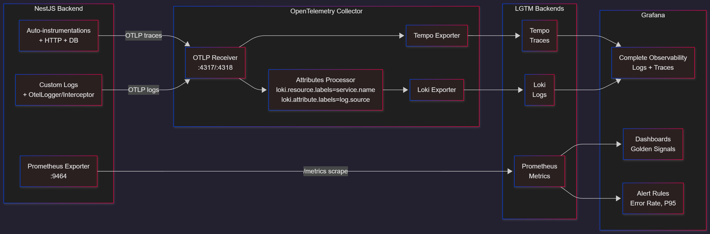

# Signal Ops

A modern observability platform built with NestJS backend and open-source observability stack (Grafana LGTM + OpenTelemetry).

## Architecture

This project follows a **monorepo** structure:

```
/backend         → Main API (NestJS + OTEL)
/observability   → Prometheus, Loki, Tempo, Grafana, OTEL Collector configs
docker-compose.yml → Orchestrates all services
```

## Tech Stack

- **Backend**: NestJS with TypeScript (ES2022)
- **Observability**: 
  - Prometheus (metrics)
  - Loki (logs)
  - Tempo (traces)
  - Grafana (visualization)
  - OpenTelemetry (instrumentation)

## Observability and Monitoring Flow

High-level data paths for metrics, logs, traces, dashboards, and alerts.



Explanation:
- The backend auto-instrumentations and SDK emit traces and logs via OTLP to the Collector.
- The Collector maps OTEL attributes into Loki labels (e.g., `service_name`) and forwards logs to Loki and traces to Tempo.
- Metrics are exposed directly by the SDK on port 9464 and scraped by Prometheus.
- Grafana visualizes metrics/logs/traces and evaluates alert rules on Prometheus metrics.

## What you can test

### Backend API

- **Health**: `GET http://localhost:3002/health`
- **Docs (Swagger)**: `http://localhost:3002/api/docs`
- **CRUD (Tasks)**:
  - `GET http://localhost:3002/tasks`
  - `POST http://localhost:3002/tasks` (JSON body: `{ title, description?, completed?, priority?, dueDate? }`)
  - `GET http://localhost:3002/tasks/:id`
  - `PATCH http://localhost:3002/tasks/:id`
  - `DELETE http://localhost:3002/tasks/:id`
- **Intentional signal generators**:
  - Slow route (latency): `GET http://localhost:3002/tasks/slow`
  - Error-prone route (random 500s): `GET http://localhost:3002/tasks/error-prone`

### Metrics, Logs, Traces

- **Metrics** (Prometheus-scrapable): `http://localhost:9464/metrics`
- **Prometheus UI**: `http://localhost:9090`
- **Grafana**: `http://localhost:3001` (datasources are provisioned)
- **Logs (Loki)**: Explore → query with LogQL label
  - `{service_name="signal-ops-backend"}`
  - Error-only example: `{service_name="signal-ops-backend"} |= "ERROR"`
- **Traces (Tempo)**: Explore → Tempo → Search by `service.name = signal-ops-backend`

## Generate signal data

Run the built-in load generator to produce requests, errors, and slow calls.

```bash
# defaults: base=http://localhost:3002, concurrency=10, rps=30, duration=180s
node scripts/load.js

# customize
BASE_URL=http://localhost:3002 \
CONCURRENCY=20 \
RPS=60 \
DURATION_SEC=300 \
node scripts/load.js
```

While the load runs:
- **Prometheus**: check target `backend:9464` and query rate/latency histograms
- **Grafana**: Explore
  - Logs (Loki): filter by `service_name="signal-ops-backend"`
  - Traces (Tempo): search by service and see spans from controller → service → DB
  - Dashboards: open “SignalOps - Complete Observability”

## Development

### Prerequisites

- Docker & Docker Compose
- Node.js 18+ (for local development)
- Git

### Quick Start

1. Clone the repository:
```bash
git clone https://github.com/helioLJ/signal_ops.git
cd signal_ops
```

2. Start the full observability stack:
```bash
docker compose up -d
```

3. Access services:
- Grafana: http://localhost:3001 (admin/admin)
- Prometheus: http://localhost:9090
- Backend API: http://localhost:3002
- SDK Metrics (Prometheus-scrapable): http://localhost:9464/metrics

Dashboards provisioned (Grafana → SignalOps folder):
- SignalOps - Complete Observability (Golden signals + Logs + Traces)
- SignalOps - Golden Signals

## Implementation notes (OpenTelemetry ↔ Loki/Tempo)

- Backend OTEL SDK exports:
  - Traces via OTLP HTTP → Collector (`OTEL_EXPORTER_OTLP_TRACES_ENDPOINT=http://otel-collector:4318/v1/traces`)
  - Logs via OTLP HTTP → Collector (`OTEL_EXPORTER_OTLP_LOGS_ENDPOINT=http://otel-collector:4318/v1/logs`, `OTEL_LOGS_EXPORTER=otlp`)
  - Metrics exposed locally on 9464 (Prometheus exporter)
- Collector pipelines:
  - `receivers: [otlp]`
  - Logs: `processors: [attributes/logs_to_labels, batch]` → `exporters: [loki]`
  - Traces: `processors: [batch]` → `exporters: [otlp/tempo]`
- Loki label mapping from OTEL is done via attributes processor hints:
  - `loki.resource.labels = service.name` → label `service_name`
  - `loki.attribute.labels = log.source` → label `log_source`

## Troubleshooting

- Logs panel shows “No data”:
  - Check Loki labels: `curl -s http://localhost:3100/loki/api/v1/labels | jq` should include `service_name`.
  - If missing, ensure Collector is up and using the attributes processor hints; restart `otel-collector` and `backend`.
  - Generate traffic for 1–2 minutes and retry.
- Error Rate panel is empty:
  - Needs ~5 minutes of traffic (2xx+5xx) to populate `rate(http_server_duration_count[5m])` windows.
- Tempo has no traces:
  - Hit endpoints; verify Collector metrics or Grafana Tempo Explore with `service.name=signal-ops-backend`.

### Development Workflow

- **Branching**: `main` (production), `dev` (development), `feature/*` (features)
- **Commits**: Follow [Conventional Commits](https://conventionalcommits.org/)
- **Testing**: `npm run test` (in backend directory)

## Project Structure

```
signal_ops/
├── backend/           # NestJS API
│   ├── src/
│   ├── test/
│   └── package.json
├── observability/     # Grafana, Prometheus, Loki, Tempo configs
│   ├── grafana/
│   ├── prometheus/
│   └── otel-collector/
├── docker-compose.yml
└── README.md
```

## Contributing

1. Create a feature branch: `git checkout -b feature/your-feature`
2. Make your changes
3. Run tests: `npm run test`
4. Commit with conventional format: `feat: add new feature`
5. Push and create a Pull Request

## License

MIT License - see LICENSE file for details.
